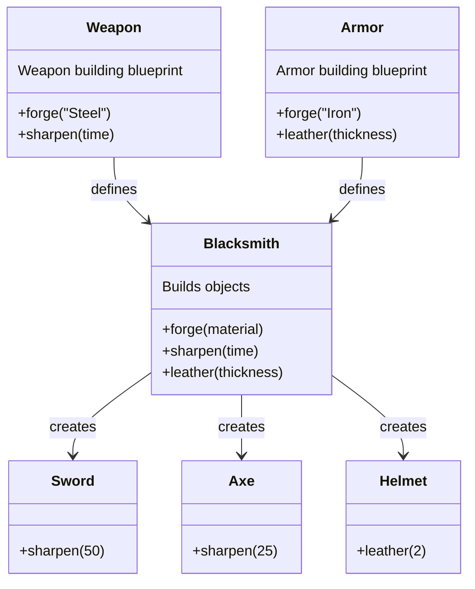

### Factory Method

Factory Method is a creational design pattern that provides an interface for creating objects in a superclass, but allows subclasses to alter the type of objects that will be created.

# Real World Analogy

- A blacksmith crafts Weapons
- The weapons are Axes and Swords
- All the weapons must be :
    - Forged
    - Sharpend

Making a sword or an axe uses the same tools and process, but with different parameters.
The blacksmith could easily start making spears, the tools are already implemented (forging / sharpening).
On the other hand, it wount be easy to start making bows, as he doens't have the tool to build them.

# Problem

- How to structure similar object
- Prevent rewrites when adding an object

# Why Factory Method ?

-  **Consistency:** By centralizing the creation process in a factory method, it ensures that all objects are created in a consistent manner.

-  **Reusability:** The same creation process can be reused for different types of objects, (must share a common interface or base class)

-  **Maintanability:** New types of objects requires minimal changes to the existing code. 

- **Flexibility:** New types can be introduced by simply extending the base class and overriding the factory method. This allows changes to be controlled individually for each new type.

-  **Open/Closed Principle:** The pattern adheres to the open/closed principle, meaning the code is open for extension but closed for modification. New functionalities can be added by extending the class without modifying existing code.

# Schema 

